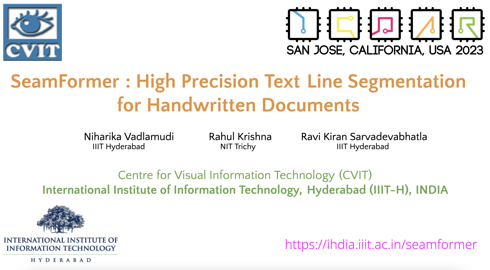
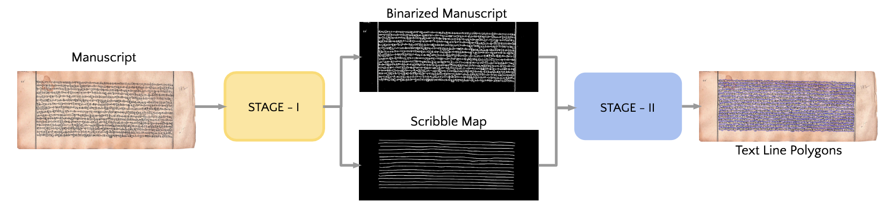
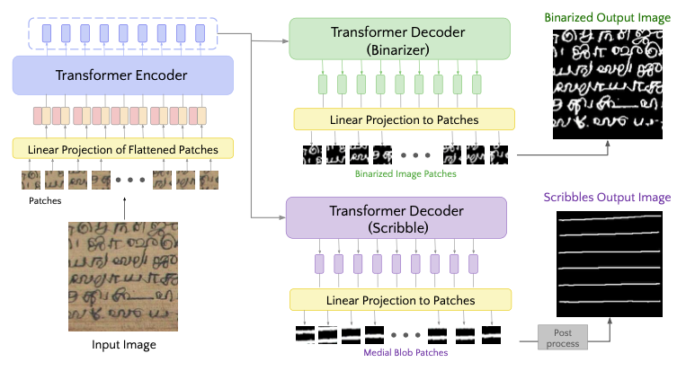
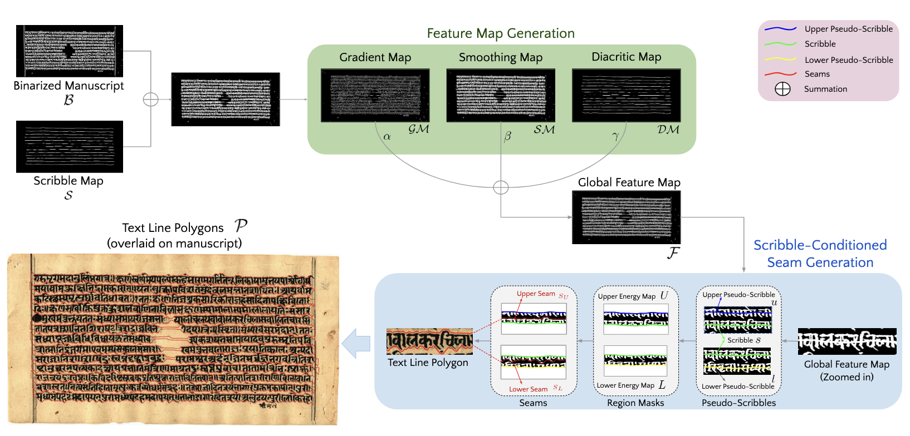
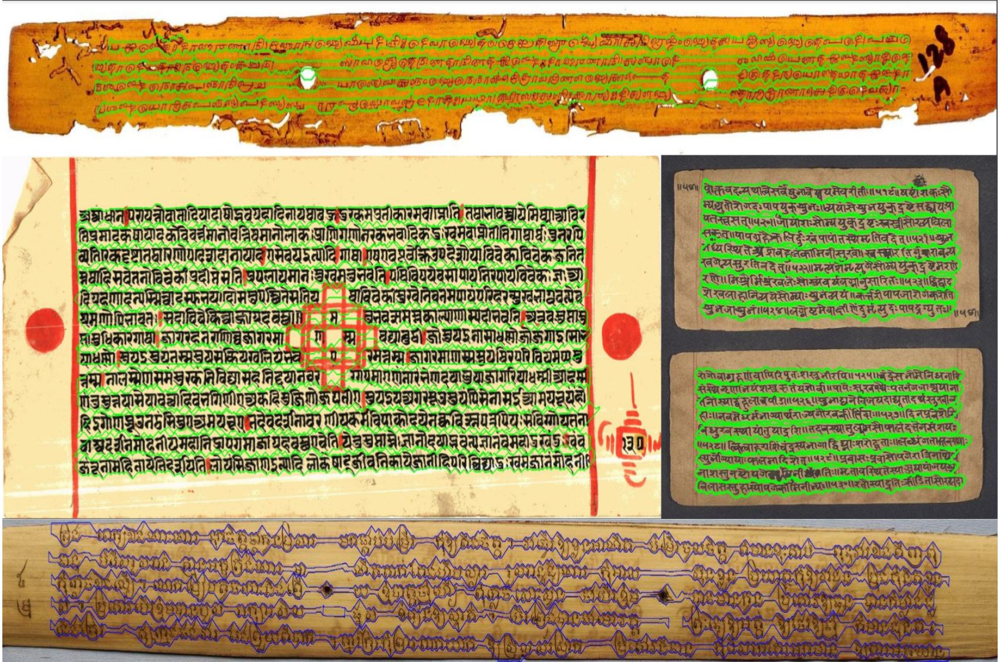

<div align="center">

<samp>
<h1> SeamFormer </h1>
<h2> High Precision Text Line Segmentation for Handwritten Documents </h2>
</samp>

**_[ICDAR 2023](https://icdar2023.org/)_**

| **[ [```Paper```](<https://drive.google.com/file/d/1UU_4irR3m8IuuzuOXYl35eK6UbD2d3tH/view>) ]** | **[ [```Website```](<https://ihdia.iiit.ac.in/seamformer/>) ]** |
|:-------------------:|:-------------------:|

<table>
    <tr>
        <td>
            <a href="https://drive.google.com/file/d/1aztOQW7b24D1OqzJ3Yv-j9XPG0iBbnap/view?usp=sharing" target="_blank">
                
            </a>
        </td>
    </tr>
    <tr>
        <th><samp><a href="https://drive.google.com/file/d/1aztOQW7b24D1OqzJ3Yv-j9XPG0iBbnap/view?usp=sharing" target="_blank">Teaser Video (Click to view)</a></samp></th>
    </tr>
</table>
</div>

---
</div>

## Table of contents
---
1. [Getting Started](#getting-started)
2. [Model Overview](#model-overview)
3. [Model Inference](#model-inference)
4. [Training](#model)
    - [Polygon to Scribble](#poly-to-scr)
    - [Training Data Preparation](#Data-Preparation)
    - [Configuration](#Preparing-the-configuration-file)
    - [Stage-1](#stage-1)
    - [Stage-2](#stage-2)
5. [Finetuning](#finetuning--custom-dataset) 
6. [Citation](#citation)
7. [Contact](#contact)

## Getting Started
---
To make the code run, install the necessary libraries preferably using [conda](https://www.anaconda.com/) or else [pip](https://pip.pypa.io/en/stable/) environment manager.

```bash
conda create -n seamformer python=3.7.11
conda activate seamformer
pip install -r requirements.txt
```

## Model Overview
---
Overall Two-stage Architecture: Stage-1 generated binarised output with just text content along with a scribble map. Stage-2 uses these two intermediate outputs to generate Seams and finally the required text-line segmentation. 

<div align="center">


</div>

<br>
Stage - 1: Uses Encoder-Decoder based multi-task vision transformer to generate binarisation result in one branch and scribble(strike-through lines) in another branch.

<div align="center">

    
</div>

<br>
Stage - 2: Uses binarisation and scribble output from previous stage to create custom energy map for Seam generation. Using which final text-line segments are produced

<br>

<div align="center">

    
</div>


## Training
---
The SeamFormer is split into two parts:
- Stage-1: Binarisation and Scribble Generation [ Requires Training ]
- Stage-2: Seam generation and final segmentation prediction [ No Training ]

### Preparing the Data
To train the model dataset should be in a folder following the hierarchy: 
In case of references to datacode , it is simply a codeword for dataset name .
For example , Sundanese Manuscripts in short form is known as `SD`. 
```
├── DATASET
│   ├── <DATASET>_Train
│   │   ├── images/
│   │   ├── binaryImages/
│   │   ├── <DATASET>_TRAIN.json
│   ├── <Dataset>_Test
│   │   ├── images/
│   │   ├── binaryImages/
│   │   ├── <DATASET>_TEST.json
│
├── ...
```

### Preparing the configuration files
For each experiment, internal parameters have been extracted to an external configuration JSON file. To modify values for your experiment, please do so here. For quick reference , check out [Sample_Exp_Configuration](https://github.com/ihdia/seamformer/blob/main/Sample_Exp_Configuration.json).

  | Parameters  | Description | Default Value
  | ----------  | ----------- | ------------- |
  | dataset_code   | Codename for dataset   | I2 | 
  | data_path   | Dataset Folder  | /data/ | 
  | model_weights_path   | Location to store trained weights  | /weights/ | 
  | visualisation_folder   | Folder path to store visualisation results | /vis_results/ | 
  | learning_rate   | Initial learning rate of optimizer (scheduler applied) | 0.005-0.0009 | 
  | weight_logging_interval  | Epoch interval to store weights, i.e 3 -> Store weight every 3 epoch    | 3 | 
  | img_size   | ViT input size    | 256 x 256| 
  | patch_size   | ViT patch size   | 8 x 8 | 
  | encoder_layers   | Number of encoder layers in stage-1 multi-task transformer   | 6 | 
  | encoder_heads   | Number of heads in MHSA    | 8 | 
  | encoder_dims   | Dimension of token in encoder   | 768 | 
  | batch_size   | Batch size for training   | 4 | 
  | num_epochs   | Total epochs for training   | 30 | 
  | mode   | Flag to train or test. Either use "train"/"test"   | "train" | 
  | train_scribble   | Enables scribble branch train  | false| 
  | train_binary  | Enables binary branch train   | true | 
  | pretrained_weights_path   | Path location for pretrained weights(either for scribble/binarisation)   | /weights/ | 
  | enableWandb  | Enable it if you have wandB account, else the results are stored locally in  `visualisation_folder`  | false |
  | wid   | WandB experiment Name (optional)   | I2_V0_Train_lr_0.001 | 

### Stage-1

Stage 1 comprises of a multi-task vision transformer for binarisation and scribble generation.
You can refer to our sample Sundanese dataset JSON [here](https://drive.google.com/file/d/1bYqKGPeqZ0XpFJS6d9X8rKk078ESTUHn/view?usp=sharing).

#### Sample train/test.json file structure
```bash
[
  {"imgPath": "./ICDARTrain/SD_DATA/SD_TRAIN/images/palm_leaf_1.jpg",
   "imgDims": [2000,1000],
   "gdPolygons": [[11,20]..[13,25],....[[101,111]..[1121,2111]]],
  },
  ...
  {"imgPath": "./ICDARTrain/SD_DATA/SD_TRAIN/images/palm_leaf_2.jpg",
   "imgDims": [1111,7777],
   "gdPolygons": [[77,21]..[11,21],....[[222,233]..[1121,1111]]],
   ...
  },
]
```
#### Training Data Preparation : Binarisation & Scribble Generation

The Stage I architecture of the SeamFormer pipeline is dependent on image patches (default : 256 x 256 pixels). Therefore, by providing the path folder and relevant parameters, the following script arranges the patch data within their corresponding folders. For the provided polygon/box annotations within `datapreparation.py`  we have generate the scribbles.

*Note* : The argument `binaryFolderPath` is optional , and in case if your dataset does not have a binarisation ground truth , it will rely Sauvola-Niblack technique to create the binarisation images.

```bash
python datapreparation.py \
 --datafolder './data/' \
 --outputfolderPath './SD_patches' \
 --inputjsonPath './data/ICDARTrain/SD_DATA/SD_TRAIN/SD_TRAIN.json' \
 --binaryFolderPath './data/ICDARTrain/SD_DATA/SD_TRAIN/binaryImages'
```

#### Training Binarisation Branch
For the SeamFormer pipeline , we first start out by training the encoder and binarisation branch (while freezing scribble branch ) . To start the process , you can optionally initialise with [DocENTR's pretrained weights](https://drive.google.com/file/d/1qnIDVA7C5BGInEIBT65OogT0N9ca_E97/view).

```bash
python train.py --exp_json_path 'Sample_Exp_Configuration.json' --mode 'train' --train_binary
```

After every epoch , we perform validation and we store the train loss , average PSNR and few randomly selected image patches along with their ground truth in `visualisation_folder`. If `enableWandB` is configured to be 'true' , then they automatically get synced to corresponding WandB account's dashboard and will be tracked across experiment runs. Additionally , you can override the parameter by specifying `--wandb` flag while executing the above command.
 
#### Training Scribble Branch 
For training of the binarisation branch , we initialise the branch weights with the prior binary branch weights for better text localisation. 

```bash
python train.py --exp_json_path 'Sample_Exp_Configuration.json' --mode 'train' --train_scribble
```

### Stage-2
---
For leveraging Stage II - Scribble conditioned seam generation independantly , we need to provide set of image path , binary image path and the corresponding scribbles as input . If these are avaiable in a JSON file , then the following command can be executed : 

```bash
python3 seam_conditioned_scribble_generation.py --jsonPath 'XYZ.json'  --outputjsonPath './OUT_XYZ.json'
```
The script will return the predicted text lines and store the results in the configured outputjsonPath.Please note that internal parameters like alpha , beta and gamma are configured to the optimal value. 

## Downloading Pre-Trained Weights
Download our existing modelcheckpoints for SeamFormer network via the following commands , additionally you have to override `pretrained_weights_path` in experiment configuration file accordingly.
```bash
pip install gdown 
```
For Indiscapes2 Dataset Checkpoint 
```bash
gdown 1O_CtJToNUPrQzbMN38FsOJwEdxCDXqHh
```
For Balinese/Sundanese/Khmer Checkpoint 
```bash
gdown 1nro1UjYRSlMIaYUwkMTrfZzrE_kz0QDF
```
Alternatively , you can also run the `downloadWeights.sh` file for one shot download of all the various dataset 
pretrained weights . Please configure the destination path inside the bash script.

```bash
bash downloadWeights.sh
```

## Inference : 
---
For our pipeline infrence, we have provided two options for our users : via an input json file & input image folder path . In the former case , we expect details of imgPath of the test samples present in the JSON File . Please note , you will have to enable flag `input_json` or `input_folder` accordingly.

Case I : Via JSON File 
```bash
python3 inference.py --exp_name "v0" --input_image_json 'test.json' --output_image_folder './output' --model_weights_path 'BKS.pt' --input_json 
```
Case I : Via Image Folder Path 
```bash
python3 inference.py --exp_name "v0" --input_image_folder './test/images/' --output_image_folder './output' --model_weights_path 'BKS.pt' --input_folder
```
Please note , by default we store all the visualisations - binary image , raw scribble image and scribble overlaid images in the sub-directories of `visualisation_folder` , you can turn it off via '`vis` flag.

## FineTuning : Custom Dataset 

For leveraging SeamFormer for your custom dataset , these points can be useful in deciding the parameters and model checkpoint
that would be optimal for you . 
- Parameters that are to carefully configured.
  - In `datapreparation.py`
    - THICKNESS - This parameter defines the thickness of scribble ground truth. Reduce this as needed if the predicted scribbles are so thick so that two scribbles merge into one.
    - OVERLAP - If you think you have fewer number of images in your dataset , increase overlap to 0.50 or 0.75 so that you get more training patches.
- Choose learning rate and a finetuning strategy (refer topic 'When and how to fine-tune' in [CS231n Notes](https://cs231n.github.io/transfer-learning/)) based on available data at hand and its closeness to pretrained data. 
  - You can choose to unfreeze decoder(for binariser/scribble branch) alone and train decoder alone. Additionally , you can choose to unfreeze few layers of the decoders as well . Or you can choose to unfreeze both decoder and encoder for binarisation, but it is preferred to always freeze encoder during scribble generation and only finetune its decoder.
  - Freezing and unfreezing parameters can be configured in `builModel()` in `train.py` using the command `param.requires_grad = False`  appropriately
    - By default 
      - During Binarisation: Scribble decoder branch's weights is freezed
      - During Scribble Generation: Binary branch's decoder and also the encoder is freezed.
- Configuration of GPU that we used and typical training time to achieve these results : 
  - 1 *NVIDIA GeForce GTX 1080 Ti* GPU, 12 GB of GDDR5X VRAM , 20 CPUs.
- Refer sample training setup that we used for Sundanese Dataset [here](./SundaneseExperiment/SD_Configuration.json).

## Visual Results
Attached is a collated diagram , starting top (clockwise ) from Bhoomi , Penn-In-Hand (PIH) , Khmer Palm Leaf Manuscript and Jain Manuscript . Of particular significance is the intrinsic precision exhibited by the predicted polygons depicted within, handling the presence of considerable image degradation, a complex multi-page layout, and an elevated aspect ratio, etc. 

  

# Citation
Please use the following BibTeX entry for citation .
```bibtex
@inproceedings{vadlamudiniharikaSF,
    title = {SeamFormer: High Precision Text Line Segmentation for Handwritten Documents},
    author = {Vadlamudi,Niharika and Rahul,Krishna and Sarvadevabhatla, Ravi Kiran},
    booktitle = {International Conference on Document Analysis and Recognition,
            {ICDAR}},
    year = {2023},
}
```
# Contact
For any queries, please contact [Dr. Ravi Kiran Sarvadevabhatla](mailto:ravi.kiran@iiit.ac.in.)

# License
This project is open sourced under [MIT License](LICENSE).
